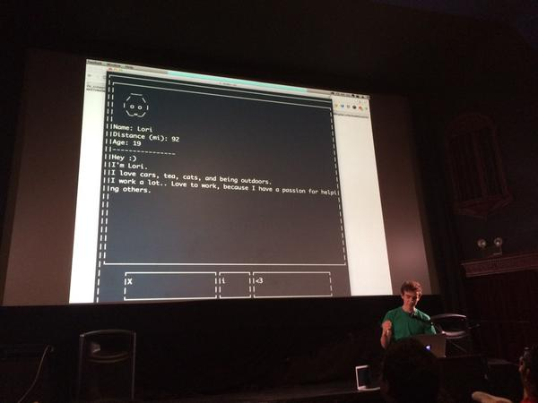

# Pyre

Pyre is a command-line interface for Tinder built at the [2015 Stupid Shit No
One Needs & Terrible Ideas Hackathon](https://stupidhackathon.github.io/) in San
Francisco.

## Installation

    $ go get github.com/zachlatta/pyre

If you don't have Go on your system, or would rather download a static binary,
head over to the [releases page](https://github.com/zachlatta/pyre/releases) and
grab the latest binary for your system.

## Usage

    $ pyre -token="insert access token" -id="insert facebook user id"

Get your Facebook ID
[here](http://findmyfacebookid.com/).
Get your Tinder access token
[here](https://www.facebook.com/dialog/oauth?client_id=464891386855067&redirect_uri=https://www.facebook.com/connect/login_success.html&scope=basic_info,email,public_profile,user_about_me,user_activities,user_birthday,user_education_history,user_friends,user_interests,user_likes,user_location,user_photos,user_relationship_details&response_type=token)
Once there, go to your browser's developer console, click to the Network tab, and go to the above URL again. After the second traversal, you should see two network calls on the developer console. Click the first one and look at its response headers. There should be a "location" field in the header. The value of that field should contain an auth_token.

#### Keybindings

Pyre has vi keybindings, of course.

| Action        | Key |
|---------------|-----|
| Like          | `l` |
| Pass          | `h` |
| Dismiss popup | `j` |

## License

The MIT License (MIT)

Copyright (c) 2015 Zach Latta

Permission is hereby granted, free of charge, to any person obtaining a copy of
this software and associated documentation files (the "Software"), to deal in
the Software without restriction, including without limitation the rights to
use, copy, modify, merge, publish, distribute, sublicense, and/or sell copies of
the Software, and to permit persons to whom the Software is furnished to do so,
subject to the following conditions:

The above copyright notice and this permission notice shall be included in all
copies or substantial portions of the Software.

THE SOFTWARE IS PROVIDED "AS IS", WITHOUT WARRANTY OF ANY KIND, EXPRESS OR
IMPLIED, INCLUDING BUT NOT LIMITED TO THE WARRANTIES OF MERCHANTABILITY, FITNESS
FOR A PARTICULAR PURPOSE AND NONINFRINGEMENT. IN NO EVENT SHALL THE AUTHORS OR
COPYRIGHT HOLDERS BE LIABLE FOR ANY CLAIM, DAMAGES OR OTHER LIABILITY, WHETHER
IN AN ACTION OF CONTRACT, TORT OR OTHERWISE, ARISING FROM, OUT OF OR IN
CONNECTION WITH THE SOFTWARE OR THE USE OR OTHER DEALINGS IN THE SOFTWARE.
